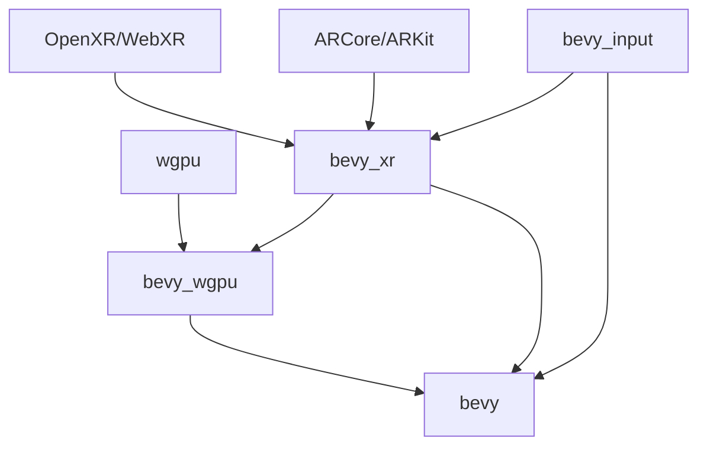

`bevy_input` definitions include some xr specific buttons.

`bevy_xr` defines `TrackedDevice` of type `Head`, `LeftController`, `RightController`, `GenericTracker(N)`. `bevy_xr` exposes some data about the view, and defines a `XrCamera` for convenience which parameters are automatically updated.

`bevy_xr` sends tracking and input data to the the objects in `World`.

`bevy_xr` adds `bevy_xr::XrResourceContext` to `World`, which contains `xr_instance` and other primitives. `XrResourceContext` exposes `create_context()` and `create_swapchain()` (the swapchain should have a reference to the xr context to control the drop order), which return objects that contain patform specific handles (neither gfx-hal or wgpu).

`bevy_wgpu` checks the presence of `XrResourceContext` and loads it, then calls `XrResourceContext::create_context()` and `XrResourceContext::create_swapchain()`.
